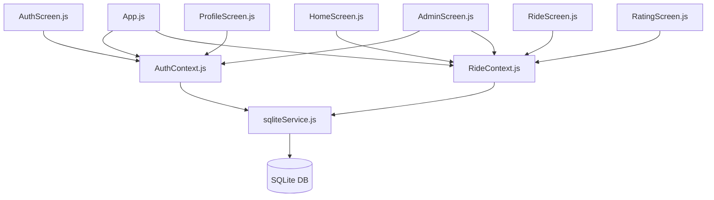

# Database Migration to SQLite and Bug Fixes Plan

Migrate the database layer of the **Caronas ICEA** Expo mobile application from Firebase (Firestore + Authentication) to local **SQLite** using the `expo-sqlite` package. During this migration, we will review the codebase, resolve existing bugs (such as incorrect passenger rating lookups), and refactor direct database calls from the screens into clean context-driven services to improve architecture and maintainability.

---

## User Review Required

> [!IMPORTANT]
> **Database Transition:** All data will now be stored locally on the device inside a SQLite database. This means authentication, ride listings, and user data will persist on-device.
> **Package Installation:** We will add `expo-sqlite@~11.1.1` (compatible with Expo SDK 48) to the dependencies.

---

## Proposed Changes

We will introduce a central database service, refactor the application contexts, clean up the UI screens, and optimize utility helpers.

### 1. Database Service Layer

#### [NEW] [sqliteService.js](src/services/sqliteService.js)
Establish a connection, create tables if they do not exist, and implement all SQL transactional query methods.
- **Tables and Schema:**
  - **`users`:** `uid` (TEXT PRIMARY KEY), `email` (TEXT UNIQUE), `password` (TEXT), `name` (TEXT), `phone` (TEXT), `userType` (TEXT), `vehicle` (TEXT), `licensePlate` (TEXT), `createdAt` (TEXT), `rating` (REAL), `totalRatings` (INTEGER), `isAdmin` (INTEGER), `isActive` (INTEGER), `reservations` (TEXT - JSON array), `ratings` (TEXT - JSON array)
  - **`rides`:** `id` (TEXT PRIMARY KEY), `from_place` (TEXT), `to_place` (TEXT), `price` (REAL), `totalSeats` (INTEGER), `availableSeats` (INTEGER), `departureTime` (TEXT), `notes` (TEXT), `vehicle` (TEXT), `licensePlate` (TEXT), `driverId` (TEXT), `driverName` (TEXT), `driverRating` (REAL), `createdAt` (TEXT), `cancelled` (INTEGER), `cancelledAt` (TEXT), `completed` (INTEGER), `completedAt` (TEXT), `passengers` (TEXT - JSON array), `ratings` (TEXT - JSON array)
  - **`reports`:** `id` (TEXT PRIMARY KEY), `type` (TEXT), `description` (TEXT), `reporterId` (TEXT), `reporterName` (TEXT), `createdAt` (TEXT), `resolved` (INTEGER), `resolvedAt` (TEXT), `resolvedBy` (TEXT)
- **Reactivity (Pub-Sub):**
  - Implement a `subscribeToRides` pub-sub pattern to reactively notify and re-render ride lists whenever a change occurs in rides, resolving the lack of Firebase's real-time `onSnapshot`.
- **Query Wrappers:**
  - `registerUserInDb(email, password, userData)`
  - `loginUserInDb(email, password)`
  - `updateUserProfileInDb(uid, updates)`
  - `getUserStatsInDb(uid)`
  - `createRideInDb(rideData, driverUser)`
  - `cancelRideInDb(rideId)`
  - `reserveSeatInDb(rideId, userId)`
  - `cancelReservationInDb(rideId, userId)`
  - `completeRideInDb(rideId)`
  - `submitRatingInDb(ratingData, raterUid, raterName)`
  - `getUnresolvedReportsInDb()`
  - `getAllUsersInDb()`
  - `resolveReportInDb(reportId, adminUid)`
  - `toggleUserStatusInDb(userId, currentStatus)`

---

### 2. Context Updates (State Management)

#### [MODIFY] [AuthContext.js](src/context/AuthContext.js)
- Replace all `firebase/auth` and `firebase/firestore` imports with calls to `sqliteService.js`.
- Integrate `@react-native-async-storage/async-storage` to store and load the logged-in user `uid` persistently across app restarts.
- Populate default mock administrators and initial mock data upon the first database creation so the app is immediately usable (e.g. creating a default admin user `admin@ufop.edu.br` with password `123456`).

#### [MODIFY] [RideContext.js](src/context/RideContext.js)
- Replace Firestore imports with calls to `sqliteService.js`.
- Use the SQLite reactive subscriber model to update context `rides` state automatically, keeping the UI updated when rides are published, completed, or cancelled.

---

### 3. Screen Modifications & Decoupling

#### [MODIFY] [RideScreen.js](src/screens/RideScreen.js)
- Remove all imports of Firebase.
- Migrate the ride loading, reservation, and cancellation queries to calls via the central `RideContext` or `sqliteService`.
- Standardize the `departureTime` handling from SQLite datetime string back to Firestore-compatible timestamp mapper (`.toDate()`) so the UI rendering logic remains unchanged.

#### [MODIFY] [ProfileScreen.js](src/screens/ProfileScreen.js)
- Remove Firestore imports.
- Load stats (rides as driver/passenger) directly via a SQLite service call or context call `getUserStats`.

#### [MODIFY] [MyRideScreen.js](src/screens/MyRideScreen.js)
- Remove Firestore queries.
- Query rides via context-driven subscription or a direct SQLite helper fetch.

#### [MODIFY] [AdminScreen.js](src/screens/AdminScreen.js)
- Remove Firestore imports.
- Implement tab queries (fetching reports, fetching users, toggling status, resolving reports) via SQLite helper methods.

#### [MODIFY] [RatingScreen.js](src/screens/RatingScreen.js)
- **Critical Bug Fix:** In the current implementation, ratings are saved using `ratingData.ratedUser` which contains the passenger's *name* rather than their *id* (UID). We will correct this by passing the actual passenger `id` to the database update operations.
- Remove Firestore imports and perform all updates via the database service.

---

### 4. Code Health & Utilities

#### [MODIFY] [formatters.js](src/utils/formatters.js)
- Make date/time formatting robust so it handles standard JavaScript Date objects, strings, and Firestore Timestamp-like objects gracefully.

---

## Verification Plan

### Automated/Compilation Verification
1. Run ESLint/Babel validation checks to ensure no broken imports or syntactic errors.
2. Confirm success of local dependencies build.

### Manual Verification Steps
1. **Initial Seed Verification:** Verify that the database creates and seeds a default admin account.
2. **Auth Flow:** Register a new user, log in, restart the app, and verify that the session is persisted locally.
3. **Ride Flow:** Create a ride, verify it is immediately added to the feed, reserve seats as another user, and verify available seat decrement.
4. **Rating Flow:** Complete a ride, rate passengers, and verify that the passenger rating updates correctly on their profile.
