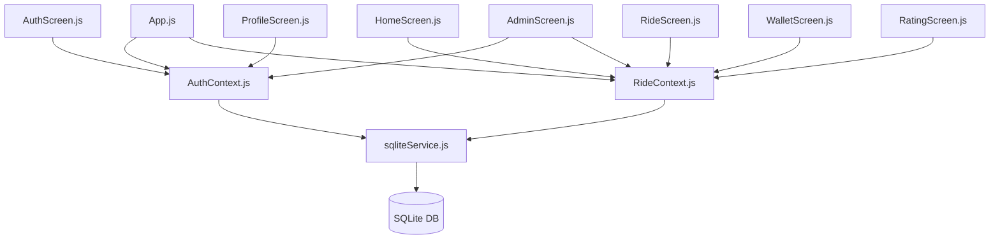
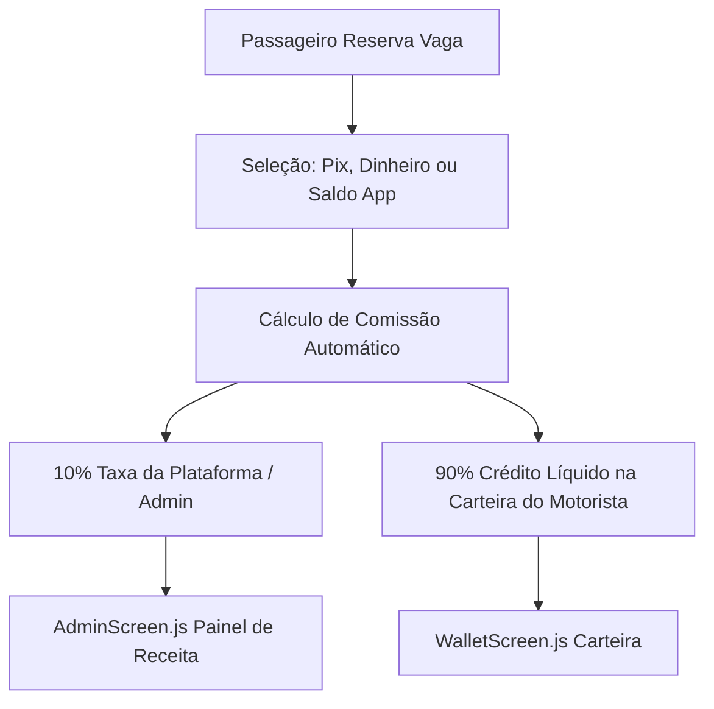

# Walkthrough: Caronas ICEA - Master Architecture, Migration & Upgrades

We have successfully migrated the **Caronas ICEA** application database from **Firebase (Firestore + Authentication)** to local **SQLite** storage using `expo-sqlite` and `AsyncStorage`, fixed all known legacy bugs, and transformed the app into a professional, highly secure, strictly validated, and user-friendly mobile application with a complete 10% platform commission engine.

---

## 🛠️ Master Architecture Overview

---

## 📁 Part 1: Database Migration to SQLite & Bug Fixes

### 1. Unified SQLite Service Layer (`sqliteService.js`)
Created a robust database management file at [sqliteService.js](src/services/sqliteService.js) that handles:
* **Automatic Schema Bootstrapping:** Automatically creates SQLite tables: `users`, `rides`, `transactions`, and `reports`.
* **Mock Data Seeding:** Seeds standard demonstration accounts on first run so the application is ready for testing immediately:
  * **Admin Account:** `admin@ufop.edu.br` (password: `123456`)
  * **Driver Account:** `driver@ufop.edu.br` (password: `123456`, vehicle: *Fiat Uno*, license plate: *ABC1D23*)
  * **Passenger Account:** `passenger@ufop.edu.br` (password: `123456`)
  * **Demonstration Rides & Reports:** Instantly pre-populates active rides and pending admin reports.
* **Promise-Wrapped SQLite Execution:** Exposes an `executeSql` helper that wraps transactions in Promises, allowing modern, clean `async/await` syntax.
* **Pub-Sub Reactive Model:** Replaces Firebase’s real-time `onSnapshot` with a lightweight, 100% reactive subscription model (`subscribeToRides`) which notifies all active screens whenever a ride is created, joined, cancelled, or completed.

### 2. Context-Driven Logic & Session Persistence
* **[AuthContext.js](src/context/AuthContext.js):** Replaced Firebase Auth calls with SQLite database verification. Added local session persistence via `@react-native-async-storage/async-storage` (`ice_carpool_user_session` key) so that users remain logged in across application launches.
* **[RideContext.js](src/context/RideContext.js):** Interfaces directly with the SQLite Pub-Sub service. It maps and filters active, future, and uncancelled rides on the fly so screens render the feed instantly.

### 3. Screen Decoupling & Legacy Bug Fixes
* **Rated Passenger Doc Lookup Bug (Fixed!):** In `RatingScreen.js`, driver passenger reviews were updated using `ratingData.ratedUser` (passenger name) rather than UID. Corrected to pass `selectedUser.id` (UID) through `onSubmit`.
* **Time/Date Formatting Failures (Fixed!):** Rewrote [formatters.js](src/utils/formatters.js) to dynamically support JS Date instances, objects implementing `.toDate()`, and raw SQLite ISO datetime strings.

---

## 🎨 Part 2: Professional UI & High-Legibility Design System

* **Unified Theme Tokens ([theme.js](src/constants/theme.js)):** UFOP Navy (`#0A3D62`), Electric Blue (`#2563EB`), Slate Background (`#F8FAFC`), and high-contrast text tokens (`#0F172A`).
* **Route Timeline Card ([RideCard.js](src/components/RideCard.js)):** Visual route timeline (Green Origin Dot ➔ Vertical Line ➔ Red Destination Dot), star rating badges (`⭐ 4.8`), status pills, vehicle plate tags, and price highlights.
* **Toasts & Skeleton Placeholders:** Replaced raw `Alert.alert` calls with [ToastNotification.js](src/components/ToastNotification.js), added [SkeletonCard.js](src/components/SkeletonCard.js) for loading states, and [EmptyState.js](src/components/EmptyState.js) for empty search results.

---

## 🔒 Part 3: Security & Strict Validation Rules

* **SHA-256 Password Hashing ([security.js](src/utils/security.js)):** Pure JS SHA-256 password hashing for SQLite user accounts with automatic fallback for legacy test accounts.
* **4-Digit Boarding PIN System:** Every ride generates a unique **4-digit passenger PIN**. Passengers view their PIN on their ticket card, while drivers enter the PIN via a modal in [RideScreen.js](src/screens/RideScreen.js) to initiate the trip (`Em Andamento`).
* **Inflexible Validation Engine:** Blocks drivers from self-booking, prevents past ride creation, and enforces atomic seat reservations.

---

## 👥 Part 4: Usability, Direct WhatsApp & SOS Integration

* **1-Tap WhatsApp Button:** Direct contact button pre-filling message details (*"Olá! Sou o passageiro Mariana da sua carona..."*).
* **SOS / Trip Sharing:** Emergency share button using native share dialogs to send ride details (driver, model, plate, itinerary) to emergency contacts.
* **Search & Filter Chips ([HomeScreen.js](src/screens/HomeScreen.js)):** Origin/destination search bar + category chips (*Todas*, *Com Vagas*, *Hoje*, *Manhã*, *Tarde*, *Noite*, *Minhas Caronas*).
* **Location Presets & Input Masks:** Location preset chips (*Campus ICEA*, *Centro*, *Rodoviária*, *Carneirinhos*) and automatic phone `(31) 9XXXX-XXXX` and plate `ABC1D23` formatting.

---

## 💰 Part 5: Payment, Receipts & 10% Platform Commission System

* **10% Admin Commission Engine:**
  * **Platform Fee**: **10%** automatically retained per reservation.
  * **Driver Net Payout**: **90%** credited to driver's digital wallet.
  * *Example*: A **R$ 10,00** fare yields **R$ 9,00** for the driver and **R$ 1,00** for the platform.
* **Wallet Screen ([WalletScreen.js](src/screens/WalletScreen.js)):** Driver financial dashboard displaying net balance (90%), total gross volume, platform commission paid (10%), transaction log, and Pix Key configuration.
* **Payment Selector ([RideScreen.js](src/screens/RideScreen.js)):** Passengers select payment method (Pix, Cash, App Wallet) with 1-tap **"Copiar Chave Pix"** button.
* **Admin Revenue Audit ([AdminScreen.js](src/screens/AdminScreen.js)):** Admin tab displaying total 10% commission revenue, total volume processed, and system-wide transaction log.

---

## 🧪 Master Verification & Testing Steps

1. **Local Authentication & Hashing Verification:**
   - Log in using `driver@ufop.edu.br` / `123456`.
   - Register a new account under `@ufop.edu.br` and confirm session persistence via AsyncStorage.
2. **Ride Feed, Search & Filter Verification:**
   - Filter rides on **Home** feed by destination or time of day (*Manhã, Tarde, Noite*).
   - Publish a new ride and verify location presets and instant feed updates.
3. **Boarding PIN & Safety Verification:**
   - Reserve a seat as a Passenger and note the 4-digit **PIN de Embarque** (e.g. `1234`).
   - Log in as Driver, open the ride, tap **Iniciar Viagem**, and enter the PIN to change status to `Em Andamento`.
4. **WhatsApp & SOS Test:**
   - Tap **Falar no WhatsApp** to verify pre-filled deep links.
   - Tap **SOS / Enviar** to verify native share sheet.
5. **Financial Commission Test:**
   - Reserve a **R$ 10,00** seat selecting Pix payment method.
   - Open **Carteira** as Driver to confirm **+R$ 9,00** net credit.
   - Log in as Admin to confirm **+R$ 1,00** platform revenue in **Admin -> Comissões**.
